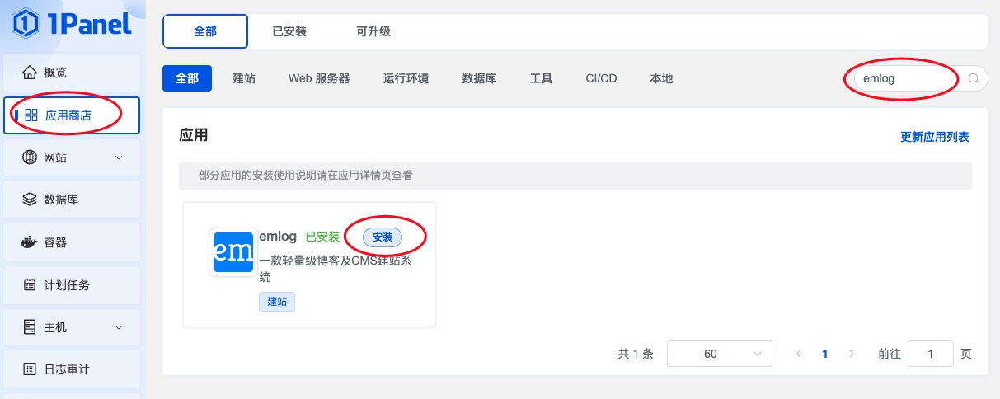

# &#x1F354; 1Panel emlog deployment

## 1Panel introduction

1Panel is a modern, open source Linux server operation and maintenance management panel.

- For details, please see: [1Panel official website](https://1panel.cn/)

## Install basic software

Before installing emlog, you need to install the required software in the 1Panel app store, including OpenResty and MySQL.

## Install emlog application

Search and install emlog in the app store: Open the [App Store] on the left menu, enter: emlog in the upper right corner, and click Search

Click Install to enter the installation interface and fill in the information as shown below.

- Fill in the port 8080
- Just fill in localhost for the domain name
- CPU and memory limits remain at default
- Port external access, no need to check
- Edit compose file, no need to check

After clicking to confirm the installation, the installation process will begin. Wait for a while and the emlog application status will change to the started status, as shown below.

## Create website

After completing the installation of the emlog application, a website will not be automatically created at this time. We need to manually create a website, and then bind the emlog application to this website to access it using a domain name.

Click Website in the 1Panel menu to enter the website list page and click the Create Website button.

- Add the domain name to be bound, such as: demo.emlog.in

## The installation is complete

Access the domain name bound above and enter the emlog administrator account and password setting interface. After the setting is completed, the installation is over.

## Other configurations - enable HTTPS

- Click the [Website] menu on the left to enter the website management interface, click the domain name to enter the website settings
- Find the [HTTPS] setting on the left side of the basic settings and enable HTTPS
- Then follow the prompts to fill in the certificate-related configuration information.

---

## Other installation methods

- [Manual emlog deployment](install_1panel2/)

